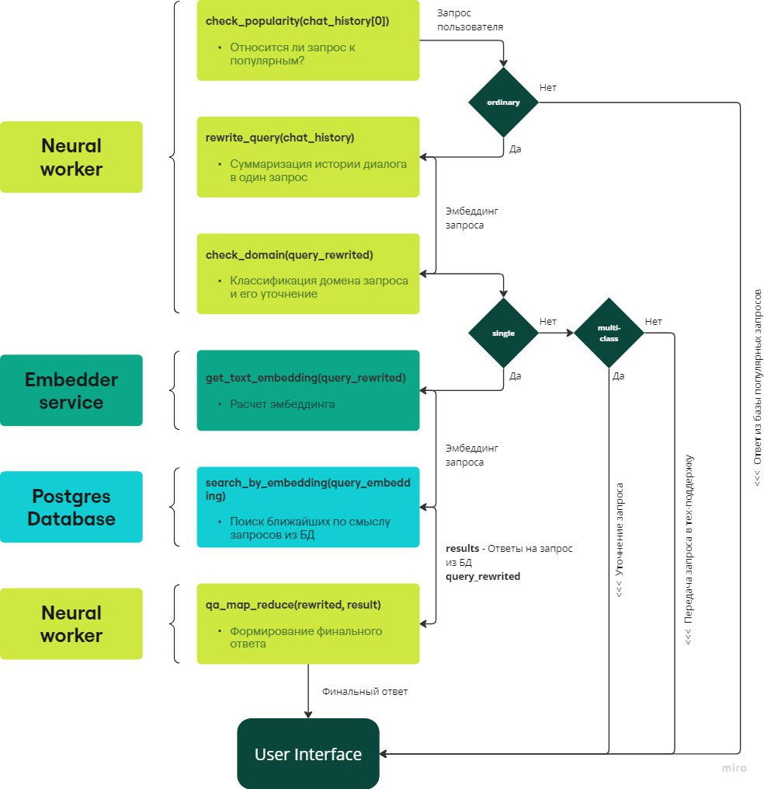
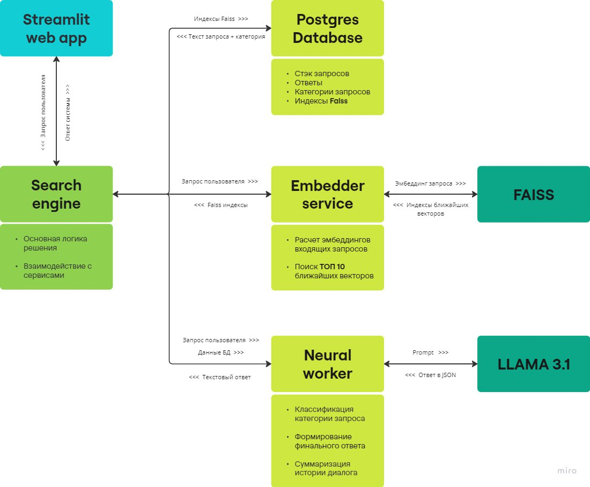
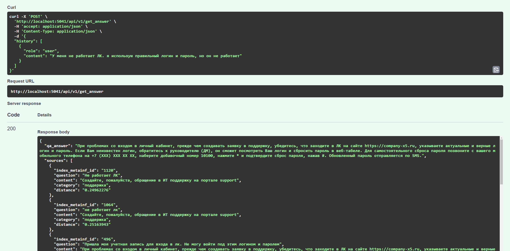

<div id="top"></div>

<!-- PROJECT LOGO -->
<br />
<div align="center">


<h3 align="center">ITMO ⇔ X5 Hackathon</h3>

  <p align="center">
    Tech Support Chatbot
  </p>
</div>

<!-- TABLE OF CONTENTS -->
<details>
  <summary>Table of Contents</summary>
  <ol>
    <li>
      <a href="#updates">Updates</a>
    </li>
    <li>
      <a href="#about-the-project">About The Project</a>
      <ul>
        <li><a href="#built-with">Built With</a></li>
      </ul>
    </li>
    <li>
      <a href="#getting-started">Getting Started</a>
      <ul>
        <li><a href="#prerequisites">Prerequisites</a></li>
        <li><a href="#installation">Installation</a></li>
      </ul>
    </li>
    <li><a href="#acknowledgments">Acknowledgments</a></li>
  </ol>
</details>


<!-- UPDATES -->
## Updates 

### 13.09.2024:

We have made significant improvements to our API service, enhancing its efficiency and accuracy.
We've also optimized our prompt engineering for better generate. 
Additionally, we've developed a user-friendly interface using streamlit that includes advanced features such as the ability to view the sources of each response, providing transparency and context. 
The service is now publicly accessible, ensuring broader usability. 
For a seamless user experience, the <a href="http://81.94.159.73:8501/">UI</a> version is available at: http://81.94.159.73:8501

The project is now in Test state, API and <a href="http://81.94.159.73:8501/">UI</a> are fully functional, all prompts enhanced, map reduce and requests history rewriting functionality deployed. 

For better QA quality <a href="https://huggingface.co/meta-llama/Meta-Llama-3.1-70B-Instruct">LLaMA3.1-70B</a> launched in quantized 4-bit.


### 07.09.2024:
The project is now in MVP state, consists of several services (API, Embedder, LLM, PSQL) and fully functional.

Right now the only way to interact with the system is API, that is available after service deployment. `/api/v1/get_answer/` endpoint accepts whole dialogue history and uses RAG to retrieve passages to generate answer. 

For now we use <a href="https://huggingface.co/meta-llama/Meta-Llama-3.1-8B-Instruct">LLaMA3.1-8B</a> launched in quantized 4-bit as main LLM in our QA pipeline and <a href="https://huggingface.co/intfloat/multilingual-e5-base">E5-Base</a> as embedder to create and use RAG base. We are planning to try LLM-based <a href="https://huggingface.co/nvidia/NV-Embed-v2">NV-Embed-v2</a> as embedder because of it's outstanding perfomance and probably <a href="https://huggingface.co/meta-llama/Meta-Llama-3.1-70B-Instruct">LLaMA3.1-70B</a> for better QA quality.

Our plans also include:
- Prompt enhancing on every QA stage;
- Making web page for user to interact with the system;
- Upgrading RAG system with OpenSearch instead of Faiss.

For more info please visit <a href="https://www.notion.so/0473e5ebcf754e079e56fa9228acd900?v=500926c60603419c9fd743388f48b336">our notion page</a>.

<!-- ABOUT THE PROJECT -->
## About The Project

In this project we provide both highly efficient and accurate service for X5 tech support team using LLM, RAG and complex QA system. We use FastAPI with PostgreSQL and Faiss for storing, adding and searching relevant passages to generate final answer, Sentence_Transformers for embedder inference, 🤗Transformers, PEFT, bitsandbytes for LLM inference (, and Streamlit for cool and minimalistic frontend.)

Our QA pipeline includes these stages:
1) **Frequent questions catcher**: if the request is similar to most frequent ones, the service won't start whole QA pipeline and will reply with one of prepared answers instead;
2) **Query rewriter**: to make sure we use all the context available for the best retrieve possible, this module generates contextualized query from  all the dialogue history;
3) **Domain classifier**: if user's request doesn't match tech support domain, the service won't start whole QA pipeline and will ask user to clarify his question instead
4) **Retrieve**: we use Faiss with PSQL to store and search relevant passages for user's input we got from early stages.
5) **Map-Reduce/Stuff QA**: Retrieved passages are being used for generating final answer. We implemented Map-Reduce (1. every passage relevance score for request --> 2. generating answer) and Stuff (all passages with request in one prompt) schemes for QA.

### Architecture:




### API Example:


### UI Example:


<p align="right">(<a href="#top">back to top</a>)</p>

### Built With

* [LLaMA-3.1](https://huggingface.co/meta-llama/Meta-Llama-3.1-8B-Instruct)
* [Streamlit](https://streamlit.io/)
* [FastAPI](https://fastapi.tiangolo.com/)
* [PostgreSQL](https://www.postgresql.org/)
* [Faiss](https://github.com/facebookresearch/faiss)

<p align="right">(<a href="#top">back to top</a>)</p>

<!-- GETTING STARTED -->

### Installation

1. Clone the repo:
   ```
   git clone https://github.com/pavviaz/ITMO_X5_HACKATHON.git
   ```
2. Place init CSV into `api/init_data` (<a href="https://disk.yandex.ru/d/4NmL6NxnlXf-tQ">the file we use to create RAG db</a>). Change path for model and data in config files if needed
3. Create `.env` file in root directory with following keys
    ```
    # ---- SEARCH_ENGINE/PSQL ----
    SEARCH_ENGINE_PORT=...
    DB_NAME=...
    DB_USER=...
    DB_PASSWORD=...
    EMBEDDER_URL=http://search_embedder:...
    NEURAL_URL=http://neural_worker:...
    DB_HOST=postgres
    DB_PORT=...

    # ---- EMBEDDER ----
    EMBEDDER_PORT=...
    NVIDIA_VISIBLE_DEVICES_EMB=...
    TRANSFORMERS_CACHE_EMB=/cache/

    # ---- NEURAL_WORKER ----
    HF_TOKEN=...
    WORKER_PORT=7860
    NVIDIA_VISIBLE_DEVICES_LLM=...
    TRANSFORMERS_CACHE_LLM=/cache/
    ``` 
4. Build & run containers
   ```
   sudo docker-compose build
   sudo docker-compose up
   ```
Congratulations! (Streamlit is now available at `http://localhost:8501/` and) API endpoints are at `http://localhost:5041/docs`.

<p align="right">(<a href="#top">back to top</a>)</p>


<!-- CONTACT -->
## Authors

<a href="https://t.me/pavviaz">Vyaznikov Pavel</a>

<a href="https://t.me/oran9e_lime">Orlova Angelina</a>

<a href="https://t.me/nikuto11">Busko Nikita</a>

<a href="https://t.me/helilozium">Rychkov Pavel</a>


<p align="right">(<a href="#top">back to top</a>)</p>
